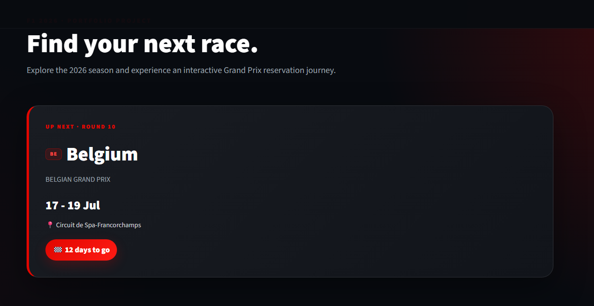
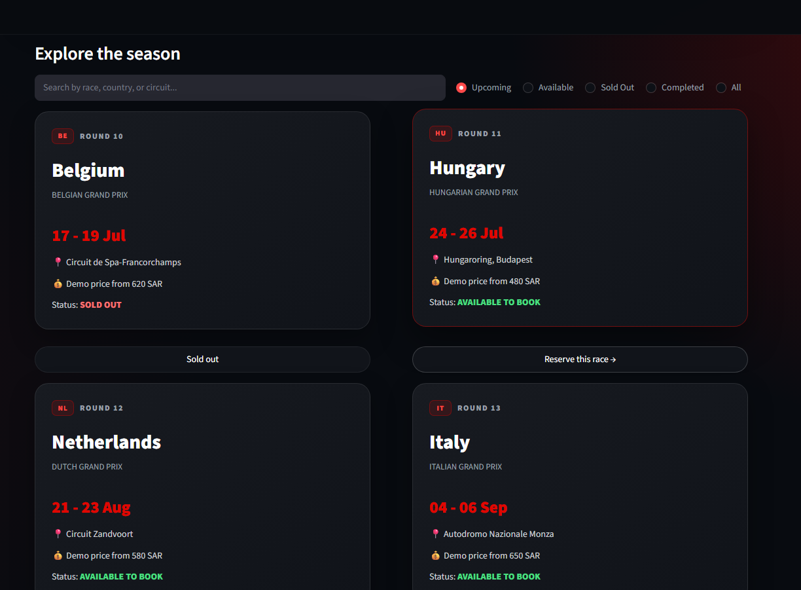
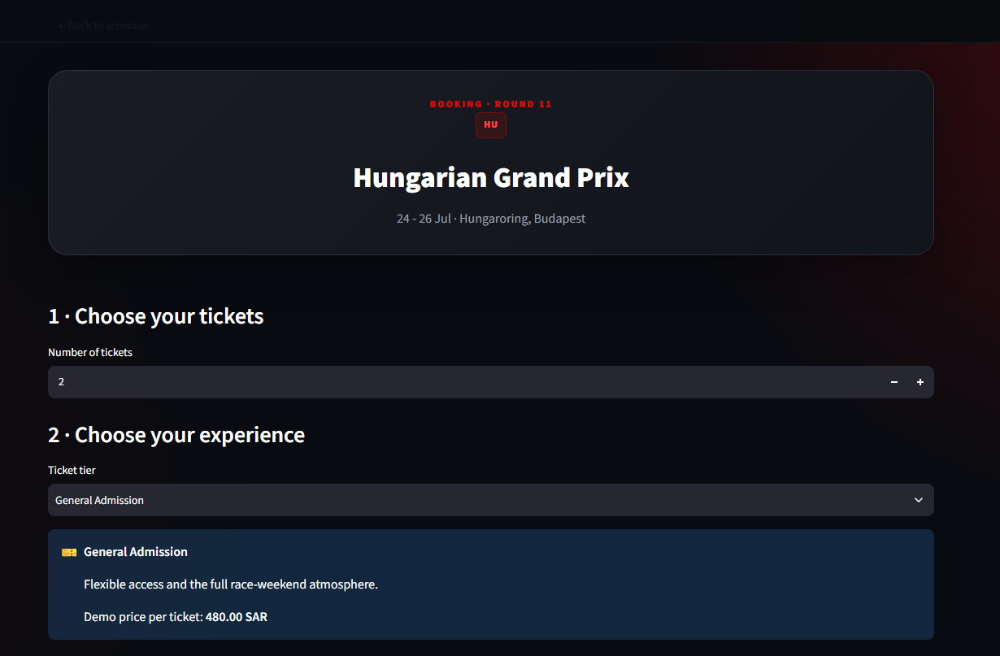
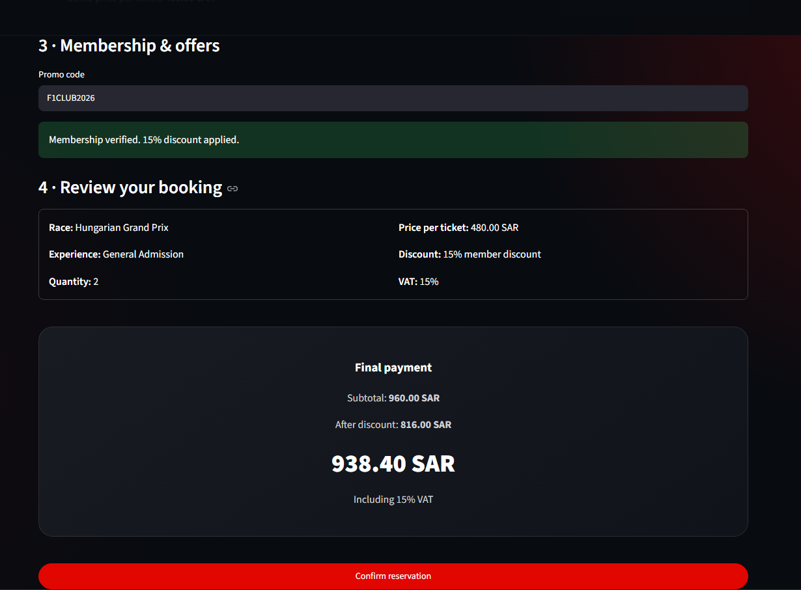
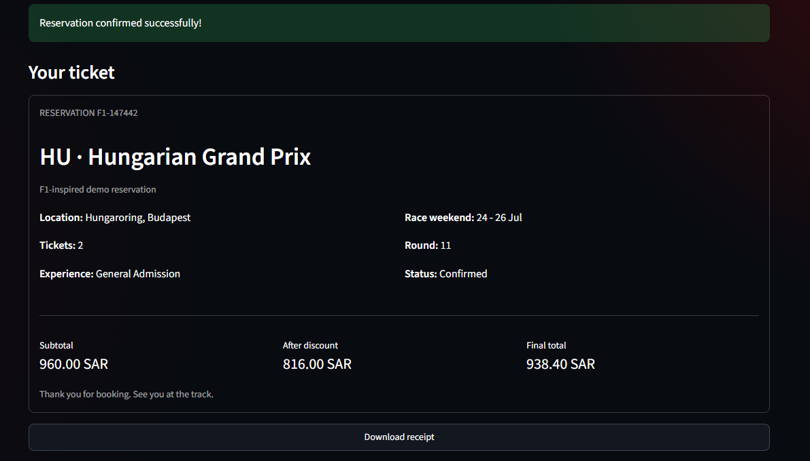

# 🏎️ F1 2026 Interactive Ticket Reservation System

An interactive Formula 1-inspired ticket reservation system built with Python and Streamlit.

Users can explore the 2026 race season, search and filter races, check booking availability, select ticket experiences, apply promo codes, calculate VAT, confirm reservations, and download receipts.

## 🚀 Live Demo

[Open the live Streamlit app](https://formula1-reservation-system-gaauyfv4efp7cbnnnx2yx5.streamlit.app/)

## 🚀 Features

- Automatic race availability updates
- Dynamic next-race countdown
- Search and status filters
- Interactive race cards
- Multiple ticket tiers
- Promo-code validation
- VAT calculation
- Reservation confirmation
- Downloadable receipts
- Dark F1-inspired interface

## 🛠️ Technologies

- Python
- Streamlit
- HTML
- CSS
- GitHub

## 📸 Screenshots

### Home




### Race Schedule



### Booking




### Reservation Confirmation



## ▶️ Run the Project

Install the requirements:

```bash
pip install -r requirements.txt
